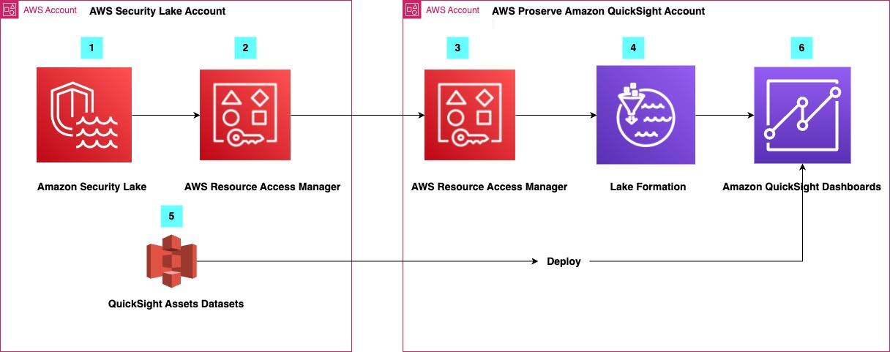

## Table of Contents
1. [About this Repo](#About)
2. [Usage Guide](#Usage)
3. [Examples](#Examples)
4. [License](#License)

## About this Repo 

This repository a combinatination of CDK tools and scripts which can be used to create the required AWS objects and deploy basic datasources, datasets, analysies, dashboards, and user groups to Quicksight with respect to Amazon Security Lake.

We welcome contributions to this repo in the form of fixes to existing examples or addition of new examples. For more information on contributing, please see the [CONTRIBUTING](https://github.com/aws-samples/amazon-security-lake/blob/main/CONTRIBUTING.md) guide.

## Solution Overview 

## Usage Guide 

Edit cdk-lakeformation-permissions/source/cdk.json using the values for your specific Amazon Security Lake and Amazon Quicksight Instance:

1. rollup_region - 
2. region - 
3. slregion - 
4. LakeFormationAdminRoleArn - 
5. SecurityLakeAccountID - 
6. AWSAccountID - 
7. QuicksightUserARN - 

		{
		  "app": "python3 app.py",
		  "context": {
		    "rollup_region": "<region>",
		    "region": "<region>",
		    "slregion": "<region>",
		    "LakeFormationAdminRoleARN": "arn:aws:iam::123456789012:role/<Rolename>",
		    "SecurityLakeAccountID": 123456789012,
		    "AWSAccountID":555555555555,
		    "QuickSightUserARN": "arn:aws:quicksight:<Region>:123456789012:user/default/<PrincipalId>"   
		  }
		}
  
Run 

	qsdeploy.sh

## Examples 

Edit cdk-lakeformation-permissions/source/cdk.json using the values for your specific Amazon Security Lake and Amazon Quicksight Instance:

1. rollup_region - 
2. region - 
3. slregion - 
4. LakeFormationAdminRoleArn - 
5. SecurityLakeAccountID - 
6. AWSAccountID - 
7. QuicksightUserARN - 
	
	
		{
		  "app": "python3 app.py",
		  "context": {
		    "rollup_region": "<region>",
		    "region": "<region>",
		    "slregion": "<region>",
		    "LakeFormationAdminRoleARN": "arn:aws:iam::123456789012:role/<Rolename>",
		    "SecurityLakeAccountID": 123456789012,
		    "AWSAccountID":555555555555,
		    "QuickSightUserARN": "arn:aws:quicksight:<Region>:123456789012:user/default/<PrincipalId>"   
		  }
		}
  
Run 

	qsdeploy.sh

### Official Resources
- [Amazon Security Lake Overview](https://aws.amazon.com/security-lake/)
- [Amazon Quicksight Overview](https://aws.amazon.com/quicksight/)

# License 

This library is licensed under the MIT-0 License.
